# idea-incubator-ai

An AI-powered idea incubation platform that transforms raw concepts into refined, actionable plans. Features intelligent analysis, feasibility checking, and development roadmap generation.

## 🗺️ System Architecture

```mermaid
flowchart TD
    subgraph Input["💡 IDEA INPUT"]
        Spark["✨ Raw Idea"]
        Context["🌍 Context"]
    end

    subgraph Incubator["🥚 AI INCUBATOR"]
        Analyzer["🔍 Idea Analyzer"]
        Enhancer["🚀 AI Enhancer"]
        Validator["✅ Feasibility Check"]
        Connector["🔗 Concept Connector"]
    end

    subgraph Output["🌱 OUTPUT"]
        Refined["💎 Refined Concept"]
        Roadmap["🗺️ Development Roadmap"]
        Resources["📚 Resource Links"]
    end

    Spark --> Analyzer
    Context --> Analyzer
    Analyzer --> Enhancer
    Enhancer --> Validator
    Validator --> Connector
    Connector --> Refined
    Refined --> Roadmap
    Refined --> Resources

    style Input fill:#FFF9C4,color:#000
    style Incubator fill:#40C4D4,color:#000
    style Output fill:#4CAF50,color:#000
```

